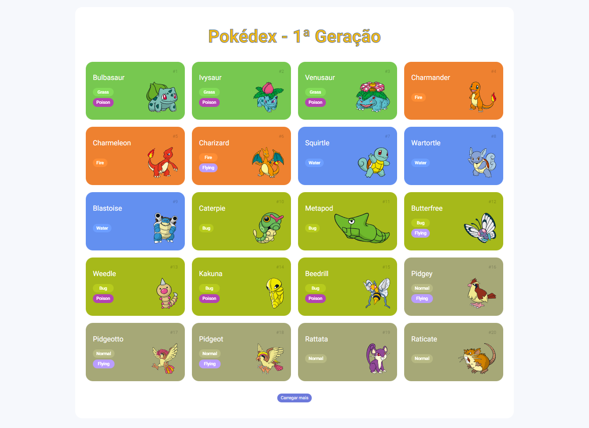
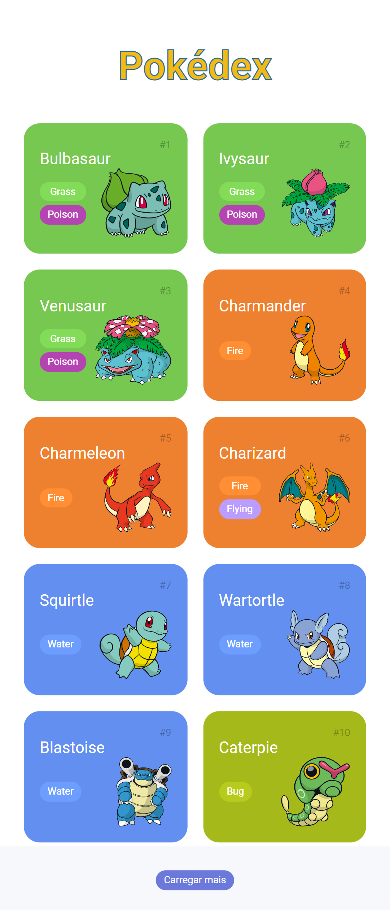

# Pokédex

## Desktop

## Mobile

## Descrição

  Pokedéx desenvolvida no módulo de JavaScript do bootcamp dio Orange Tech+

## Tecnologias usadas no projeto

- [NormalizeCSS](https://necolas.github.io/normalize.css/)